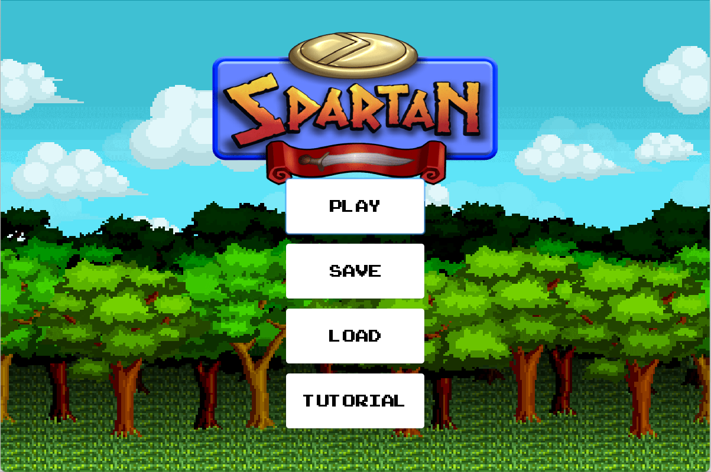
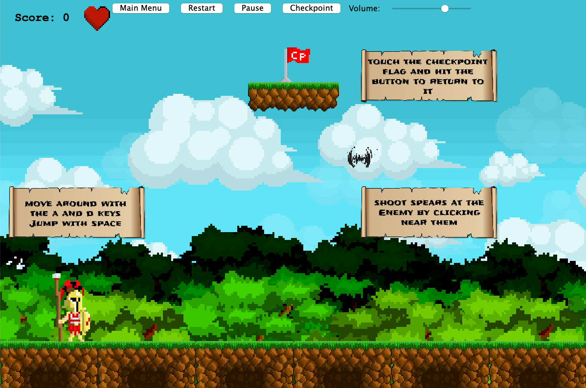
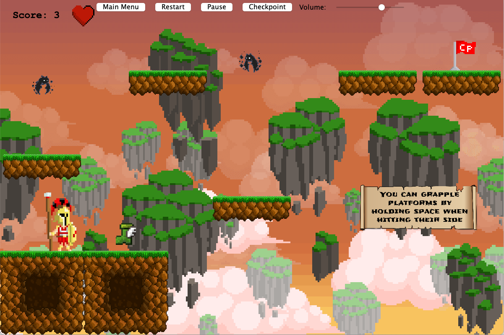

# A 2D Game Created in Java using the CUoL physics library

This is a University Coursework Project for my 'Introduction to Java' Module. 
It is a simple platformer-esque game with a bit of a twist and story.

# Preview:

# Disclaimer:
I do not take full credit for the graphics, as a lot of them were taken from Royalty Free Websites or other online sources.
Same goes for the Music and sound effects.
